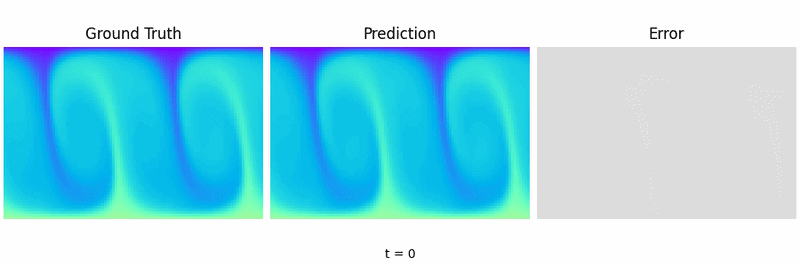
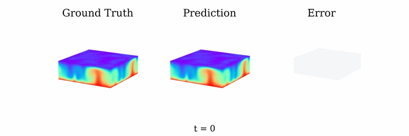

# Fourier neural operators as data-driven surrogates for two- and three-dimensional Rayleigh–Bénard convection

<a href="https://pytorch.org/get-started/locally/"></a>
<a href="https://hydra.cc/"></a>
[](https://www.sciencedirect.com/science/article/pii/S0925231226005989)

This repository contains the code for the paper [*Fourier neural operators as data-driven surrogates for two- and three-dimensional Rayleigh–Bénard convection*](https://doi.org/10.1016/j.neucom.2026.133201), published in Neurocomputing (2026).

### 2D Rayleigh–Bénard Convection


### 3D Rayleigh–Bénard Convection


<!-- TODO: Add 2D prediction video -->

## Abstract
Data-driven surrogate models provide fast and fully differentiable approximations of complex dynamical systems. In this work, we develop such surrogates for the Rayleigh–Bénard convection (RBC), which governs thermally driven flows in natural and industrial environments. Specifically, the proposed models approximate the discrete-time flow map of the RBC system, advancing the full system state by a fixed time step. We train Fourier Neural Operator (FNO)–based models to learn the dynamics of RBC in two and three dimensions and compare them to a convolutional U-Net baseline and a Koopman-based Linear Recurrent Autoencoder Network (LRAN). The two-dimensional system serves as a baseline for the more challenging three-dimensional case, which exhibits increased spatial complexity and turbulent dynamics. Across all settings, FNO-based models consistently outperform the LRAN, while achieving performance comparable to the U-Net in several regimes. Incorporating spatio-temporal inputs via FNOs leads to improved long-term prediction accuracy, particularly for turbulent flows. The physical fidelity of the predictions is assessed using convective heat flux statistics, profiles, and fluctuations, showing that FNOs most closely reproduce the ground-truth flow statistics. In addition, we demonstrate that FNOs enable zero-shot super-resolution across unseen spatial discretizations, a capability not shared by the convolutional baselines. These results highlight the potential of neural operator–based models as accurate, physically consistent, and resolution-independent surrogates for downstream tasks such as flow control.

## Rayleigh-Bénard Convection
This work uses Fourier Neural Operators to model Rayleigh-Bénard Convection (RBC) in two and three dimensions. RBC describes convection processes in a layer of fluid cooled from the top and heated from the bottom via the partial differential equations:

$$\begin{aligned}
& \frac{\partial u}{\partial t} + (u \cdot \nabla) u = -\nabla p + \sqrt{\frac{Pr}{Ra}} \nabla^2 u + T \hat e_z \\
& \frac{\partial T}{\partial t} + u \cdot \nabla T = \frac{1}{\sqrt{Ra Pr}} \nabla^2 T\ \\
& \nabla \cdot u = 0 \\
\end{aligned}$$

The surrogate models are trained on data generated by Direct Numerical Simulation using [Oceananigans.jl](https://github.com/CliMA/Oceananigans.jl) with the following parameters:

| Parameter          | 2D               | 3D             |
| ------------------ | ---------------- | -------------- |
| Domain **D**       | 2π × 2           | 4π × 4π × 2   |
| Grid **N**         | 96 × 64          | 48 × 48 × 32  |
| Ra                 | [3 · 10⁵ – 10⁷]  | 2500           |
| Pr                 | 0.7              | 0.7            |
| ($T_C$, $T_H$)    | (1, 2)           | (0, 1)         |
| Δt                 | 0.03             | 0.01           |

## Project Structure

```
RBC-FNO-Surrogate/
├── configs/                 # Hydra configuration files
│   ├── 2d_rbc.yaml          # 2D experiment config
│   ├── 3d_rbc.yaml          # 3D experiment config
│   ├── model/               # Model configs (fno, unet, lran, ae)
│   ├── data/                # Dataset configs
│   ├── experiment/          # Experiment-specific overrides
│   └── options/             # Runtime options (local, cluster, debug)
├── scripts/                 # Training, testing, and visualization scripts
├── src/rbc_fno_surrogate/   # Main package
│   ├── model/               # FNO, U-Net, LRAN, Autoencoder implementations
│   ├── data/                # Dataset and data modules
│   ├── metrics/             # Evaluation metrics (RRSSE, etc.)
│   ├── callbacks/           # Lightning callbacks for logging and visualization
│   └── utils/               # Visualization and padding utilities
└── data/                    # Symlinked dataset directory
```

## Setup

### Installation
We use [uv](https://docs.astral.sh/uv/) to manage Python dependencies.
```bash
uv sync
```
Alternatively, you can use virtual environments and install this package. Dependencies are given in `pyproject.toml`. All `uv run python` commands below can be replaced by activating your virtual environment and running `python` directly.

### Data
The simulation data is available on Hugging Face: [tmarkmann/dataset-rbc-fno](https://huggingface.co/datasets/tmarkmann/dataset-rbc-fno).

Download and link the dataset:
```bash
# Download from Hugging Face (requires huggingface-cli)
huggingface-cli download tmarkmann/dataset-rbc-fno --repo-type dataset --local-dir /path/to/rbc/dataset

# Symlink into the project
bash data/make_link.sh /path/to/rbc/dataset
```

Additional data can be generated using [RBC-Gym](https://github.com/HammerLabML/RBC-Gym) and its dataset generation scripts via
```bash
git clone https://github.com/HammerLabML/RBC-Gym
cd RBC-Gym

uv run python scripts/create_dataset_2D.py
uv run python scripts/create_dataset_3D.py
```

## Usage

This project uses [Hydra](https://hydra.cc/) for configuration management. Default configs are defined in `configs/` and can be overridden from the command line.

### Training
```bash
# Train FNO on 2D RBC (default: Ra=3e5)
uv run python scripts/train_2d_rbc.py

# Train FNO on 3D RBC
uv run python scripts/train_3d_rbc.py

# Train a different model (e.g., U-Net)
uv run python scripts/train_2d_rbc.py model=2d_unet

# Override Rayleigh number
uv run python scripts/train_2d_rbc.py data.ra=1e7
```

Available model configs: `2d_fno`, `2d_unet`, `2d_lran`, `2d_ae`, `3d_fno`, `3d_unet`, `3d_lran`, `3d_ae`.

### Logging
Experiment logging uses [Weights & Biases](https://wandb.ai/) by default. TensorBoard can be selected instead via the config:
```bash
uv run python scripts/train_2d_rbc.py logger=tensorboard
```

### Testing
```bash
# Evaluate a trained model on the test set
uv run python scripts/test_2d_rbc.py
uv run python scripts/test_3d_rbc.py

# Zero-shot super-resolution evaluation (2D)
uv run python scripts/test_2d_sr.py
```

## Citation
If you find our work useful, please cite us via:

```bibtex
@article{MARKMANN2026133201,
  title = {Fourier neural operators as data-driven surrogates
  for two- and three-dimensional Rayleigh–Bénard convection},
  journal = {Neurocomputing},
  volume = {679},
  pages = {133201},
  year = {2026},
  issn = {0925-2312},
  doi = {https://doi.org/10.1016/j.neucom.2026.133201},
  author = {Thorben Markmann and Michiel Straat and Sebastian
  Peitz and Barbara Hammer},
}
```
